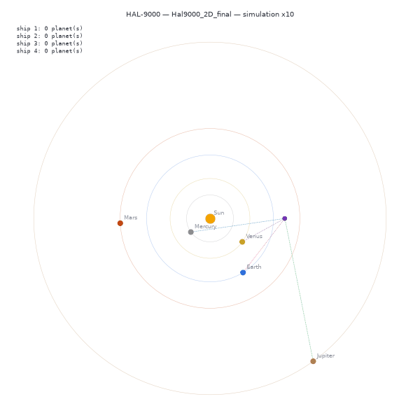

# HAL-9000

HAL-9000 is an AI autopilot trained with reinforcement learning (PPO) for the [Outer Wilds Web](https://github.com/outer-wilds-web) project: it flies a ship from planet to planet in the game's solar system, driven by the project's Rust server. The project is developed by Quentin Rollet, Marc-Antoine Vergnet, and Patrice Soulier, who also lead the development of Outer Wilds Web.

The repository is self-contained: training, evaluation and visualization run on a Python replica of the Rust server physics. The Rust server remains the final target, and every command can use it with `--server`.

<p align="center">
  
</p>

## Results

`models/Hal9000_2D_final.zip` is the trained model, used by default by every command. Episodes last 10 simulated minutes, with deterministic actions:

| Model | Evaluation | Planets reached per episode | Survival |
|---|---|---|---|
| Former `MAGB_V0` (2025) | Rust server | ~0.25 | 0% |
| `Hal9000_2D_final` | Python simulation, 300 episodes | 11.0 (median 12) | 80% |
| `Hal9000_2D_final` | Rust server, 60 episodes | 10.6 (median 12) | 80% |

The model visits the five planets about twice per episode. Most remaining deaths happen near the sun: inside ~1100 units, the sun's gravity is stronger than the engines, and only enough tangential speed avoids the fall (Mercury orbits at 943 units).

## Requirements

* **[uv](https://docs.astral.sh/uv/)**: manages Python 3.13 and the dependencies.
* Optional, to use the Rust server: **Cargo** (Rust), tested with 1.88.
* Optional, for the web interface: **npm**.

## Installation

```bash
git clone https://github.com/VERGNET-MarcAntoine/HAL-9000_DL.git
cd HAL-9000_DL
uv sync
```

`uv sync` creates a `.venv` in the project directory from the locked versions in `uv.lock`: nothing is installed in your global Python. Every command below is run with `uv run`, from the root of the project, without activating the environment. To update the dependencies: `uv lock --upgrade && uv sync`.

## Quick Start

```bash
uv run python -m hal9000.display.display_ship2D   # watch the trained model fly
uv run python -m hal9000.evaluate                 # measure its performance
uv run python -m hal9000.train --new              # train a new model
```

## How It Works

### The task

`Hal9000_2D` (`hal9000/model/Hal9000_2D.py`) must reach the five planets one after the other, in a random order, then start again, without falling into the sun or leaving the solar system (10,000 units from the sun).

* **Observations** (16 values, relative to the ship and normalized): position and speed of the ship relative to the sun, position and speed of the target relative to the ship, distances to the target and to the sun, position of the next target, and orbital quantities: radial and tangential speed relative to the sun, circular orbital speed at the current distance, and the sun's gravity compared to the thrust of an engine.
* **Actions**: every 0.2 simulated seconds, one of 9 thrust directions (8 directions or no thrust), sent to the four side engines of the ship.
* **Reward**: +10 per planet reached, -10 on death, plus the progress made toward the target at each step (distance before minus distance after, divided by 1000). Over an episode the progress term amounts to the distance covered toward the targets: circling or oscillating earns nothing.

The same code computes the observations and rewards on the Python simulation and on the Rust server.

### The Python simulation

`hal9000/sim/` is a numpy replica of the Rust server physics (`rust-server/src/body/`): same bodies and masses, same gravity, same engines, same order of operations and same 1/60 s tick. It was validated against the server: from the same state, with the same thrust, both give identical trajectories. It simulates many ships at once in a single process, about 100 times faster than the server, and a model trained on it flies on the server with the same performance.

### Configuration

All settings live in `config.toml` (see the comments in the file). Any value can be overridden for one run with `--set section.key=value`.

* `[simulation]`: speed used to watch a model (`speedup = 5`, 5 times faster than real time) and `decision_interval`, the simulated time between two decisions of the AI (0.2 s).
* `[server]`: address of the Rust server's WebSocket and location of its repository.
* `[training]`: number of ships on the Python simulation (`sim_envs`), speed and number of ships on the Rust server (`speedup`, `n_envs`), episode duration, number of steps and checkpoint frequency.
* `[reward]`: reward per planet, death penalty and scale of the progress term.
* `[ppo]`: PPO hyperparameters (learning rate, rollout and batch size, `gamma`, network size...).

## Usage

### Training

```bash
uv run python -m hal9000.train
```

Trains on the Python simulation, with 64 ships in parallel in a single process (about 6,000 steps per second on one core, PPO updates included). Training resumes from the latest saved model in `models/`. Options:

* `--new`: start from scratch; `--model`: model to resume; `--steps`: number of steps.
* `--name`: name of the model and of its TensorBoard curves, to run several trainings side by side.
* `--set`: override a value of `config.toml` for this run.
* `--server`: train on the Rust server instead (see [Using the Rust server](#using-the-rust-server)).

```bash
uv run python -m hal9000.train --new --name test_death20 --set reward.death_penalty=20
```

Checkpoints are saved in `models/` (every `save_every` steps). The policy runs on CPU, which is faster than GPU for this small network, and each training uses a single core.

**Follow a training:**

* Live: `uv run python -m hal9000.display.display_ship2D --training` shows four of the ships being trained, each in its own solar system, and the statistics of the last episodes. `--name` chooses the training to follow when several are running. The ships freeze for about a second at regular intervals: this is PPO updating the network.
* Curves: `uv run tensorboard --logdir logs`, then open `http://127.0.0.1:6006`. The `hal/` metrics are the ones that matter: planets reached per episode, survival rate and causes of death (the reward includes the progress term and is harder to interpret).

### Evaluation

```bash
uv run python -m hal9000.evaluate
```

Flies the latest model (or `--model`) with deterministic actions on 100 episodes (`--episodes`) of the Python simulation, and prints the number of planets reached per episode, the survival rate and the causes of death. `--seed` changes the starting situations. With `--server`, the episodes run on the Rust server.

### Visualization

```bash
uv run python -m hal9000.display.display_ship2D
```

Flies the latest model (or `--model`) in the Python simulation, with four ships (`--ships`) in the same solar system, their trails, a dotted line to their current target and the number of planets reached. `--speed` changes the speed (`[simulation] speedup` by default) and `--theme light` uses a white background instead of the dark one. `--save demo.gif` records the animation in a GIF instead of showing it (`--frames` images); the animation of this README was made with:

```bash
uv run python -m hal9000.display.display_ship2D --save docs/demo.gif --frames 360 --speed 10 --seed 4 --theme light
``` The other modes are `--training` (see [Training](#training)) and `--server` (see below).

## Using the Rust Server

### Setup

Clone the server's `deep_learning` branch into the HAL-9000 directory (it is ignored by git):

```bash
git clone -b deep_learning https://github.com/outer-wilds-web/rust-server.git
```

Then remove the line `rdkafka = ...` from `rust-server/Cargo.toml`: this dependency is not used by the code and requires `cmake` to build.

### Speed and synchronization

The Rust server advances the simulation by a fixed 1/60 s tick, and runs in real time: to go faster, it waits less between two ticks. The Python side must follow the same acceleration, otherwise each decision covers more or less simulated time than during training and the model behaves differently. Both are therefore derived from `config.toml`:

```bash
uv run python -m hal9000.server           # [simulation] speedup, to watch a model
uv run python -m hal9000.server --train   # [training] speedup, to train
```

This builds the server in release mode and launches it with `SIMULATION_SLEEP_TIME_MICROSECONDS = 16667 / speedup` and `SERVER_SLEEP_TIME_MICROSECONDS = 4 × SIMULATION_SLEEP_TIME_MICROSECONDS`, listening only on the host of `websocket_url` (`127.0.0.1` by default). On the Python side, each decision waits `decision_interval / speedup` seconds of real time, measured from the previous one so that the computation time does not shift the rhythm. Before training or evaluating, the scripts measure the actual speed of the server and stop if it does not match the configuration.

The server cannot go much faster than 50 times real time. The server also cuts the engines after 15 ticks (0.25 s) without a command, which is why decisions are taken every 0.2 s.

### Watching a model on the server

With the server started without `--train`:

```bash
uv run python -m hal9000.display.display_ship2D --server   # terminal 1
uv run python -m hal9000.evaluate --server --watch         # terminal 2
```

`evaluate --watch` flies four ships (`--ships`) on the server. The display shows every ship connected to the server; the ships flown by `evaluate` are shown like in the simulation, with their trail, target and number of planets reached (the server does not know the targets: `evaluate` sends them to the display on a local UDP port). The other ships, for example during a training on the server, are shown in grey.

### Training and evaluating on the server

With the server started with `--train` (25 times real time, 6 ships in parallel by default, about 500 steps per second):

```bash
uv run python -m hal9000.train --server
uv run python -m hal9000.evaluate --server
```

A warning is printed if Python cannot keep up with the simulation: lower `[training] speedup` or `n_envs` in that case.

### Web interface (optional)

The Outer Wilds Web frontend can also display the server's simulation:

```bash
git clone -b deep_learning https://github.com/outer-wilds-web/outer-wilds-front.git
cd outer-wilds-front
echo "VITE_WEBSOCKET_URL=ws://localhost:3012" >> .env
npm install
npm run dev
```

Then open `http://localhost:5173`.

## How the Final Model Was Trained

About 1h15 on a single core, on the Python simulation (the curves of every attempt are in `logs/`, visible with TensorBoard):

1. From scratch with the default `config.toml`, 20 million steps:

   ```bash
   uv run python -m hal9000.train --new --steps 20000000
   ```

2. Fine-tuning from the 20 million steps checkpoint with a lower learning rate, which stops the oscillations of the policy between checkpoints, 6 million steps with a checkpoint every 500,000 steps:

   ```bash
   uv run python -m hal9000.train --model models/Hal9000_2D_sim_20000000_steps.zip --steps 6000000 \
       --set ppo.learning_rate=1e-4 --set training.save_every=500000
   ```

3. Selection of the best checkpoint with `evaluate` (the performance still varies from one checkpoint to the next), confirmed on new episodes (`--seed`) and on the Rust server.

What made the difference, measured along the way:

* **The reward**: the progress toward the target. A discounted potential-based form (`gamma * phi(s') - phi(s)`) contained a term that rewarded staying far from the target, and the model settled for surviving at a distance. The former `MAGB_V0` reward was dominated by a bonus for thrusting toward the target, whatever the result: the model never braked, overshot and died.
* **The orbital observations**: most deaths came from falling into the sun while chasing Mercury. Giving the radial and tangential speed, the circular speed and the gravity compared to the thrust raised both the planets reached and the survival rate.
* **A larger network** (256×256) learned faster but was less stable; the lower learning rate at the end stabilized the policy.
* **What did not help**: a higher death penalty or `gamma = 0.998` made learning slower or too cautious.

## Tests

```bash
uv run pytest
```

About 20 tests, a few seconds, without the Rust server:

* **Physics**: the Python simulation reproduces trajectories recorded on the Rust server (`tests/data/server_trajectories.json`), to 1e-6 units after ~10 simulated seconds, for each engine. To record them again after a change of the server physics, start the server and run `uv run python -m tests.record_server_trajectories`.
* **Task**: reward for reaching a planet, deaths, circling the target earns nothing, orbital observations, engine directions.
* **Configuration**: overrides, synchronization of the Python and server speeds.
* **Final model**: it still reaches at least 6 planets per episode and survives most episodes on the simulation.

## Project Structure

```
config.toml                      settings (simulation, server, training, reward, PPO)
models/Hal9000_2D_final.zip      trained model
hal9000/
  model/Hal9000_2D.py            the task: observations, actions, reward
  model/core/ship2D.py           the task on the Rust server (one ship per WebSocket connection)
  model/core/training.py         training (Python simulation or Rust server), TensorBoard metrics
  model/core/loading.py          model loading
  sim/solar_system.py            numpy replica of the Rust server physics
  sim/vec_env.py                 the task on the Python simulation, many ships in one process
  sim/live.py                    live broadcast to the display (local UDP)
  display/display_ship2D.py      visualization (simulation, live training, Rust server)
  websocket/websocket_client.py  Rust server client
  config.py                      configuration loading
  server.py                      Rust server launcher, synchronized with config.toml
  train.py, evaluate.py          command-line entry points
tests/                           tests (uv run pytest)
docs/demo.gif                    animation of the README (display_ship2D --save)
logs/                            TensorBoard curves (ignored by git)
rust-server/                     Rust server, cloned separately (ignored by git)
```

To change the task, edit `hal9000/model/Hal9000_2D.py`: it is shared by the Python simulation and the Rust server. Models trained with different observations or actions are not compatible: train them from scratch with `--new`.

## Security Notes

* **Only load models you trust.** Stable-Baselines3 `.zip` files contain objects serialized with pickle, and loading a model can execute arbitrary code. The scripts load models through `hal9000.model.core.loading.load_ppo`, which avoids unpickling the saved learning-rate and clip-range functions (this also avoids crashes when loading a model with a different Python version than the one it was trained with), but other pickled objects remain.
* The WebSocket connection to the Rust server is unencrypted and unauthenticated (`ws://`), and the live display uses a UDP port bound to `127.0.0.1`. They are meant for local use only: do not expose them to an untrusted network.
